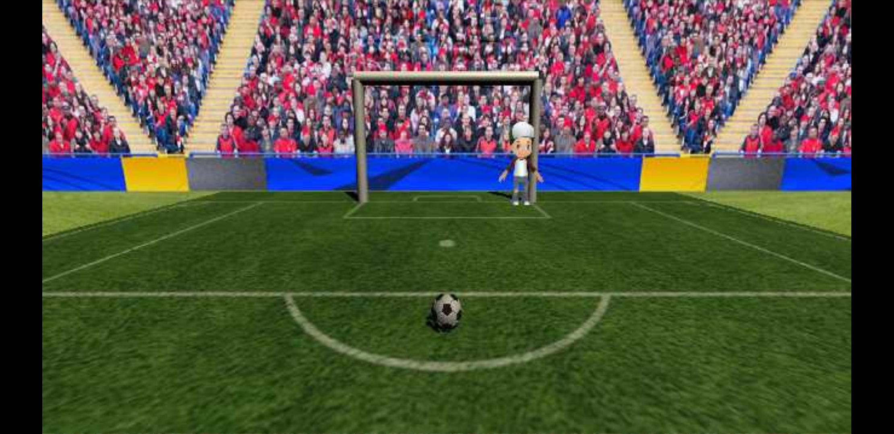

# Specializedapp

Mängu loomiseks kasutasin järgmist juhendit: https://www.udemy.com/unityandroidgamecourse/, täpsemalt seitsmendas sektsioonis esitatud mängu õpetust.
Valisin selle juhendi sest mulle meeldis, kuidas juhendaja asju seletas - väga detailselt, kuid lihtsalt. Seega võin öelda, et juhend mulle meeldis, kuigi see ei olnud lõplik. Sektsiooni osast on puudu mõned videod, kus seletatakse, kuidas saab panna väravavahi liikuma. Mis tundus mulle väga imelik, arvestades, et juhend oli tasuline.

Ise tegin ma just selle väravavahi liikumise ja lisasin teise vaate, kus saab mängu alustada.

Õppisin ma sellest juhendist väga palju, sest eriline kogemus Unity'ga mul puudub ja peaaegu kõik, mis tegin, oli uus. See, mida olin varem teinud, oli ka unustatud.

Selleks, et mängu teha Unity's Androidi jaoks, oli mul vaja muuta Build Settings ja sealt lisada Android mooduli ning
 enda telefoni lisada Unity Remote programm. Programmi kasutamiseks muutsin projekti seadeid editor'i alt.